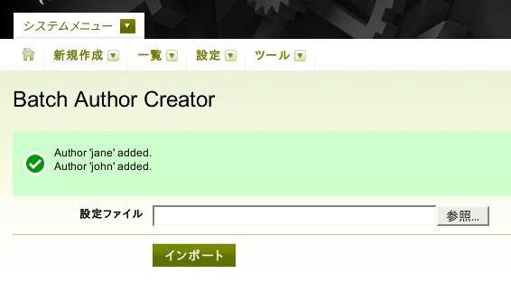

# BatchAuthorCreatorプラグイン

多数のユーザ(およびユーザの個人用のブログ)を一度にまとめて登録する機能を提供するプラグイン。

BatchAuthorCreatorプラグインは、複数ののユーザ(およびユーザの個人用のブログ)を一度にまとめて登録する機能を提供します。MT4以降専用。

## 更新履歴

 * 0.01 (2007-10-12 14:01:15 +0900):
   * 公開。

## 概要

周知の事実ですが、Movable TypeのCMSを使ってたくさんのユーザを手動で登録するのは苦痛の極みです。一人分登録するのに2分かかるとして30人分で一時間。これくらい単調作業を続けられる人は普通いません。

この問題を解決するために、BatchAuthorCreatorプラグインは「バッチ」的に、たくさんのユーザを自動的に登録する手段を実現します。YAMLベースのユーザ設定ファイルをオフラインで記述しておき、それをMT4 CMSにインポートするだけでまとめて登録できます。

## 使い方

プラグインをインストールするには、パッケージに含まれるBatchAuthorCreatorディレクトリをMovable Typeのプラグインディレクトリ内にアップロードもしくはコピーしてください。正しくインストールできていれば、Movable Typeのメインメニューにプラグインが新規にリストアップされます。

## 設定ファイルの書き方

BatchAuthorCreatorの設定ファイルはYAML形式で記述します。一つの設定ファイルに複数のユーザのエントリが書け、各ユーザのエントリは以下の形式に従います。

    <user-id>:
      nickname(*): <user nickname>
      email(*): <email-address>
      url: <url>
      password(*): <password>
      hint(*): <password hint>
      preferred_language: nl|es|de|fr|ja|en-us
      text_format: 0|markdown|markdown_with_smartypants|textile_2|__default__
      tag_delim: comma|space
      system_permissions:
        is_superuser:       0|1
        can_create_blog:    0|1
        can_view_log:       0|1
        can_manage_plugins: 0|1
      create_personal_weblog: 0|1

(*)を付けたフィールドは必須です。

理解の助けになるように以下に例を示しておきます。johnとjaneという名前のユーザを作成します。

    john:
      nickname: John Doe
      email: john.doe@domain.com
      password: PASSWORD
      hint: fusianasan
      preferred_language: ja
      text_format: 0
      tag_delim: comma
      system_permissions:
        is_superuser:       0
        can_create_blog:    0
        can_view_log:       1
        can_manage_plugins: 0
      create_personal_weblog: 1
    
    jane:
      nickname: Jane Doe
      email: jane.doe@domain.com
      password: PASSWORD
      hint: fusianasan
      preferred_language: ja
      text_format: 0
      tag_delim: comma
      system_permissions:
        is_superuser:       0
        can_create_blog:    0
        can_view_log:       0
        can_manage_plugins: 0
      create_personal_weblog: 0

## 設定ファイルの読み込み方

作業を始める前にデータベースのバックアップを取っておくこと。

 1. まず、MT4のスーパーユーザ権限のあるユーザでログインします。
 1. 次にダッシュボードから'Batch Author Creator'メニューアイテムを選択します。'Batch Author Creator'は、ブログのダッシュボード画面の「システムメニュー」か、システム全体のダッシュボード画面の「ツール」メニューの中にあります。
 1. ローカルマシンに保存されている設定ファイルを指定して、「インポート」ボタンをクリックします。
 1. うまくインポートされれば、以下のようなメッセージが表示されるはずです。

このプラグインは、すでに登録済みの名前(user-id)を持つユーザや、設定内容に問題のあるユーザは登録せずにスキップするようになっています。したがって、誤ってユーザ情報を上書きする心配は「あまり」ないはずです。

## See Also

## License

This code is released under the Artistic License. The terms of the Artistic License are described at [http://www.perl.com/language/misc/Artistic.html](http://www.perl.com/language/misc/Artistic.html).

## Author & Copyright

Copyright 2007, Hirotaka Ogawa (hirotaka.ogawa at gmail.com)
