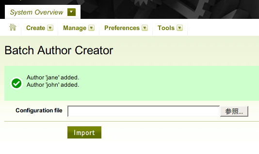

# BatchAuthorCreator Plugin

!BatchAuthorCreator plugin allows you to create multiple users and their personal blogs easily.  Decicated to MT4.

## Changes

 * 0.01 (2007-10-12 14:01:15 +0900):
   * Initial release.

## Overview

As everyone knows, it is quite hard to create many users by using MT4 CMS manually.

To resolve such a situation, !BatchAuthorCreator plugin allows you to automatically create as many users as you need, in ''batch'' style.  You can write a YAML-based configuration file at offline, and then you can import it and register to the MT4 CMS.

## Installation

To install this plugin, upload or copy '!BatchAuthorCreator' directory into your Movable Type's plugin directory. After proper installation, you will see a new "!BatchAuthorCreator <version number>" plugin listed on the Main Menu of your Movable Type.

## How to write a configuration file

Actually, !BatchAuthorCreator's configuration file is written in YAML format.  A configuration file can include multiple user entries, and each user entries is subjected to the following format:

    <user-id>:
      nickname(*): <user nickname>
      email(*): <email-address>
      url: <url>
      password(*): <password>
      hint(*): <password hint>
      preferred_language: nl|es|de|fr|ja|en-us
      text_format: 0|markdown|markdown_with_smartypants|textile_2|__default__
      tag_delim: comma|space
      system_permissions:
        is_superuser:       0|1
        can_create_blog:    0|1
        can_view_log:       0|1
        can_manage_plugins: 0|1
      create_personal_weblog: 0|1

(*) fields are mandatory fields.

To help your further understanding, I will show an example below:

    john:
      nickname: John Doe
      email: john.doe@domain.com
      password: PASSWORD
      hint: fusianasan
      preferred_language: en-us
      text_format: 0
      tag_delim: comma
      system_permissions:
        is_superuser:       0
        can_create_blog:    0
        can_view_log:       1
        can_manage_plugins: 0
      create_personal_weblog: 1
    
    jane:
      nickname: Jane Doe
      email: jane.doe@domain.com
      password: PASSWORD
      hint: fusianasan
      preferred_language: en-us
      text_format: 0
      tag_delim: comma
      system_permissions:
        is_superuser:       0
        can_create_blog:    0
        can_view_log:       0
        can_manage_plugins: 0
      create_personal_weblog: 0

## How to import a configuration file

 1. First, you need to login as a superuser of MT4 CMS.
 1. Second, select 'Batch Author Creator' menu item.  'Batch Author Creator' will be found in 'System Overview' menu in the ''Blog'' dashboard screen, or in 'Tools' menu in the ''System Overview'' dashboard screen.
 1. And, specify a configuration file in your local machine, and click ''Import'' button.
 1. And then, if successfully imported, you will see the following message.

This plugin automatically skips users which have already registered user ID and/or have malformed user entry.

## See Also

## License

This code is released under the Artistic License. The terms of the Artistic License are described at [http://www.perl.com/language/misc/Artistic.html](http://www.perl.com/language/misc/Artistic.html).

## Author & Copyright

Copyright 2007, Hirotaka Ogawa (hirotaka.ogawa at gmail.com)
